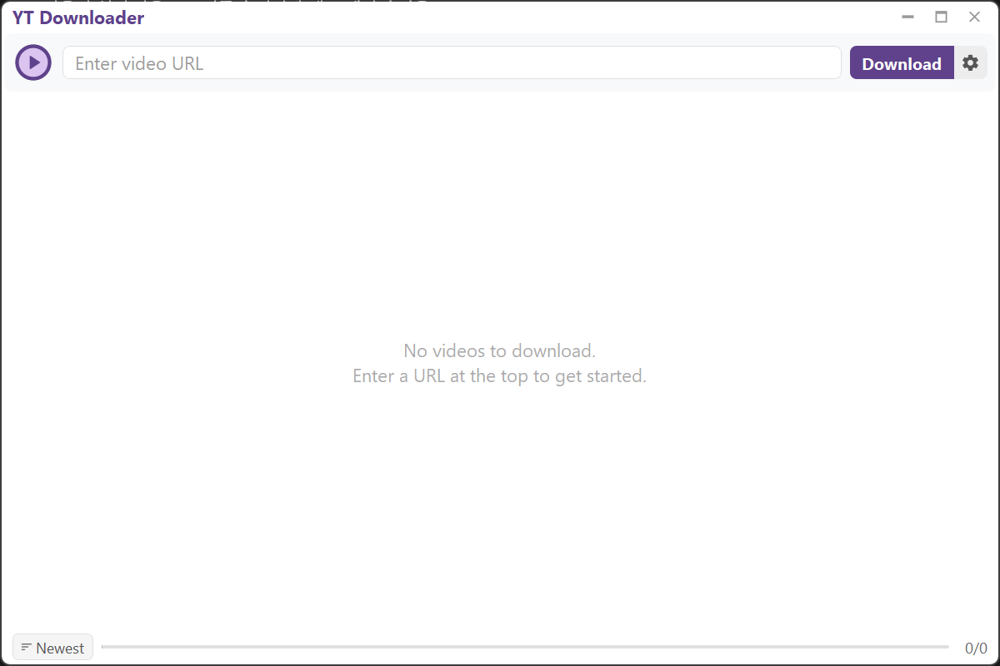
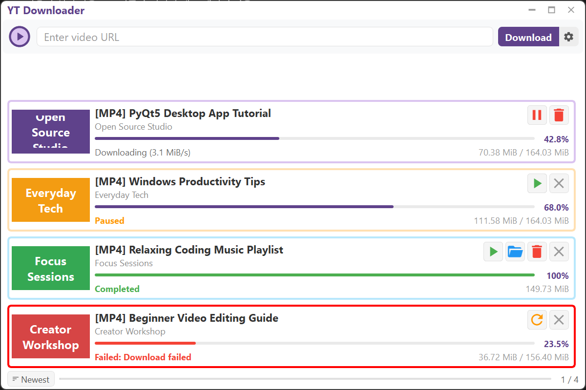
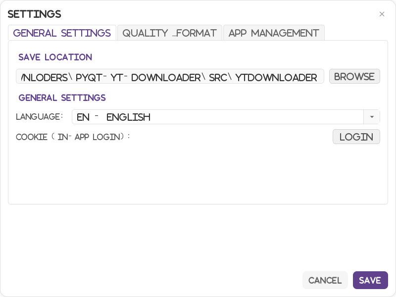

# PyQt-YT-Downloader

A Windows-only YouTube video and playlist downloader with a PyQt5 GUI. It
manages yt-dlp, FFmpeg, and QuickJS automatically, while providing video
downloads, audio conversion, and queue-based task management in one app.

Current app version: `v2.1.2`

## Screenshots







## Supported Platform

- Windows 10 or later
- Linux and macOS runtime/builds are not currently supported.

## Features

- Download single YouTube videos, Shorts, Live URLs, embed URLs, and `youtu.be` links
- Analyze YouTube playlists and register multiple videos at once
- Choose between the full playlist or the current video when a URL contains both video and playlist information
- Save video as MP4, MKV, or WebM
- Extract and convert audio to MP3, M4A, or WAV
- Select video quality: best, 1080p, 720p, 480p, 360p, worst
- Select audio quality: best, 320k, 256k, 192k, 128k, worst
- Configure the maximum number of concurrent downloads
- Optional fragment download acceleration
- FFmpeg `loudnorm` audio normalization
- Display download progress, speed, file size, and conversion/merge status
- Pause, resume, retry, play, open folder, and delete files per task
- Global pause/resume toggle for all downloads
- Sort tasks by completion, waiting, downloading, paused, and failed status
- Ctrl+V smart paste and Ctrl+A task selection
- Duplicate download checks based on download history
- Exclude duplicate items from playlists
- Save the task list on exit and restore paused tasks on the next launch
- Additional UI languages: Korean(한국어), Japanese(日本語)
- In-app YouTube login cookie storage
- Automatic install/update flow for yt-dlp, FFmpeg, and QuickJS
- App update check, license information, GitHub Sponsors link, and installed-app uninstall support
- No in-app advertisements, tracking ad SDKs, or bundled adware

## Download

Download the latest Windows executable from the
[Releases](https://github.com/heokm-repo/PyQt-YT-Downloader/releases) page.

## Funding

This app does not include advertisements, tracking ad SDKs, or bundled adware.
If you find it useful, you can support ongoing development through
[GitHub Sponsors](https://github.com/sponsors/heokm-repo).

## Usage

1. Run `YTDownloader.exe` on Windows.
2. On first launch, allow the app to download required components when prompted.
3. Paste a YouTube video or playlist URL into the top input field.
4. Adjust the download folder, quality, format, and concurrent download count in Settings if needed.
5. Click `Download` to add the task to the queue.

## Settings

- Download folder selection
- Language: English, Korean(한국어), Japanese(日本語)
- YouTube login through the in-app browser for cookie storage
- Video quality and audio quality
- Output formats: MP4, MKV, WebM, MP3, M4A, WAV
- Maximum concurrent downloads
- Audio normalization
- Fragment download acceleration
- App update check, license view, GitHub Sponsors link, and uninstall

## Runtime Components

The app manages these files under `%APPDATA%\YTDownloader\bin`:

- `yt-dlp.exe`
- `ffmpeg.exe`
- `qjs.exe`

FFmpeg is required for video/audio merging and audio conversion. QuickJS is used
for some yt-dlp JavaScript handling paths.

## Running From Source

```powershell
pip install -r requirements.txt
python src\main.py
```

## Build

These instructions are for Windows development environments.

```powershell
pip install -r requirements.txt
pip install pyinstaller
.\build.bat
```

The built executable is created in `dist/`.

## Test

```powershell
python -m pytest
```

## Disclaimer

1. This project is for educational and portfolio purposes.
2. Users are responsible for copyright, account, and Terms of Service issues caused by downloaded content.
3. Downloaded content should be used for personal purposes only.

## Libraries Used

- [PyQt5](https://www.riverbankcomputing.com/software/pyqt/)
- [PyQtWebEngine](https://pypi.org/project/PyQtWebEngine/)
- [yt-dlp](https://github.com/yt-dlp/yt-dlp)
- [requests](https://requests.readthedocs.io/)
- [qtawesome](https://github.com/spyder-ide/qtawesome)
- [FFmpeg](https://ffmpeg.org/)
- [QuickJS](https://github.com/quickjs-ng/quickjs)

## License

This project is licensed under the [GPL-3.0](LICENSE) License.
